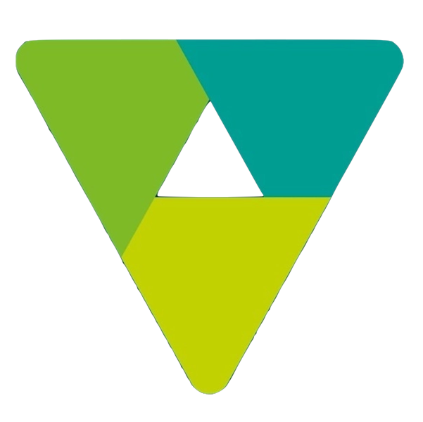

 
   

 

#

    
 Meu nome é Matheus, sou um programador e escolhi essa área pela beleza sutil que existe na criação de software . O que mais me encanta na programação é a singularidade de cada projeto: cada código é único, assim como o programa resultante. 

# 

  
  

#

 

 
    

    <h3 align="center" lang="en-US">Skills</h3>
    
    
    
    
    
    
    
    
    

  <h3 align="center" lang="en-US">Networking</h3>
  
  
  
  
  
  
  
  

#

<picture align="center">
  <source media="(prefers-color-scheme: dark)" srcset="https://raw.githubusercontent.com/matheus-alcan/matheus-alcan/output/github-contribution-grid-snake-dark.svg">
  <source media="(prefers-color-scheme: light)" srcset="https://raw.githubusercontent.com/matheus-alcan/matheus-alcan/output/github-contribution-grid-snake-dark.svg">
  
</picture>
